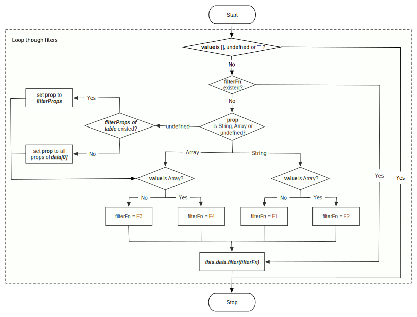

# Filter

`vue-data-tables` accepts prop `filters` for filtering the data. Value passed to `filers` should be a list, every item in it is called to `filter Item`. The `filters` is in the following format:

```
// Typescript-like definition
[
  {                                           // a filter Item
    prop?: String | Array | Undefined;        // indicates prop(s) the filter item is for
    value: any;                               // the filter value
    filterFn?: (row, filterItem) => Boolean;  // filter function leveraged by
                                              // `data-tables` to filter the data
    [key: string]: any;                       // `data-tables-server` can define any property(s) for
                                              // customizing the http request for data update
  },
  ...
]
```

`row`, the 1st parameter of filterFn, represents a item in the data set; the 2nd parameter, `filter`, is a reference to the `filter item`

## Principle of data-tables' filter

`data-tables` generate filter functions of [Array.prototype.filter](https://developer.mozilla.org/en-US/docs/Web/JavaScript/Reference/Global_Objects/Array/filter) according to `filter item` in `filters`, and then filter the data through [Array.prototype.filter](https://developer.mozilla.org/en-US/docs/Web/JavaScript/Reference/Global_Objects/Array/filter) using the generated filter functions one by one.

The following flow diagram shows how it works:


* if `value` is `[]`, `undefined` or `""`, then skip the filter.
* if property `filterFn` doesn't exist， `data-tables` creates different filter functions (F1 ~ F4), according to the value type of property `value` and `prop`。
  * `prop` is `String`, `value` is not `Array` (`F1`)
  * `prop` is `String`, `value` is `Array` (`F2`)
  * `prop` is `Array` or `undefined`, `value` is not `Array` (`F3`)
  * `prop` is `Array` or `undefined`, `value` is `Array` (`F4`)
* if `filterFn` exists, then filter with `filterFn`

> As you can find from the flow diagram, `prop is undefined` can be considered as a special case of `prop is Array`.

### `prop` is `String`, `value` is not `Array` (`F1`)

The logic of filter function `F1` is:

```
On the premise of all comparison value being stringified (simply by toString())
and ignoring case sensitivity, if the value of row[prop]
contains the filter value(`value`), then keep the row.
```

In the following example，if we filter the table with property `name` and value `us`, then only the 1st row with `name` `'USA'` can keep in the table.

```html
/*vue*/
<desc>
  enter `us` to the input and have a try
</desc>
<template>
  <div>
    <div style='margin-bottom: 10px'>
      <el-row>
        <el-col :span='6'>
          <el-input v-model='filters[0].value' placeholder='input "us" to try'></el-input>
        </el-col>
      </el-row>
    </div>

    <data-tables
      :data='data'
      :filters='filters'>
      <el-table-column v-for="title in titles"
        :prop="title.prop"
        :label="title.label"
        :key="title.prop"
      >
      </el-table-column>
    </data-tables>
  </div>
</template>

<script>
export default {
  data() {
    return {
      data: [
        { name: 'USA', rank: 1 },
        { name: 'China', rank: 2 }
      ],
      titles: [{
        prop: 'name',
        label: 'Name'
      }, {
        prop: 'rank',
        label: 'Rank'
      }],
      filters: [
        {
          prop: 'name',
          value: ''
        }
      ]
    }
  }
}
</script>
```
### `prop` is `String`, `value` is `Array` (`F2`)

The logic of filter function `F2` is:

```
On the premise of all comparison value being stringified (simply by toString())
and ignoring case sensitivity, if the value of row[prop]
contains one of the filter values, then keep the row.
```

In the following example, there are 2 rows in the table, we filter the data with property `name` and value `us` and `china`, both rows can be kept.

```html
/*vue*/
<desc>
  select 'China' and 'USA' to try
</desc>
<template>
  <div>
    <div style='margin-bottom: 10px'>
      <el-row>
        <el-col :span='6'>
          <el-checkbox-group v-model='filters[0].value'>
            <el-checkbox label='China'></el-checkbox>
            <el-checkbox label='USA'></el-checkbox>
          </el-checkbox-group>
        </el-col>
      </el-row>
    </div>

    <data-tables
      :data='data'
      :filters='filters'>
      <el-table-column v-for="title in titles"
        :prop="title.prop"
        :label="title.label"
        :key="title.prop"
      >
      </el-table-column>
    </data-tables>
  </div>
</template>

<script>
export default {
  data() {
    return {
      data: [
        { name: 'USA', rank: 1 },
        { name: 'China', rank: 2 }
      ],
      titles: [{
        prop: 'name',
        label: 'Name'
      }, {
        prop: 'rank',
        label: 'Rank'
      }],
      filters: [
        {
          prop: 'name',
          value: []
        }
      ]
    }
  }
}
</script>
```

### `prop` is `Array`, `value` is not `Array` (`F3`)

The logic of filter function `F3` is:

```
On the premise of all comparison value being stringified (simply by toString())
and ignoring case sensitivity, if one of the row property values contains
the filter value, then keep the row.
```

In the following example, we have 2 rows, and then filter the table with property [`name`, `rank`]. No matter that the value is `us` or `1`, the 1st row will always be kept.
```html
/*vue*/
<template>
  <div>
    <div style='margin-bottom: 10px'>
      <el-row>
        <el-col :span='10'>
          <el-input v-model='filters[0].value' placeholder='input "us" or "1" to try'></el-input>
        </el-col>
      </el-row>
    </div>

    <data-tables
      :data='data'
      :filters='filters'>
      <el-table-column v-for="title in titles"
        :prop="title.prop"
        :label="title.label"
        :key="title.prop"
      >
      </el-table-column>
    </data-tables>
  </div>
</template>

<script>
export default {
  data() {
    return {
      data: [
        { name: 'USA', rank: 1 },
        { name: 'China', rank: 2 }
      ],
      titles: [{
        prop: 'name',
        label: 'Name'
      }, {
        prop: 'rank',
        label: 'Rank'
      }],
      filters: [
        {
          prop: ['name', 'rank'],
          value: ''
        }
      ]
    }
  }
}
</script>
```

### `prop` is `Array`, `value` is `Array` (`F4`)

> This scenario is obscure. we don't recommend to leverage. so just skip this section if you don't have special requirement.

The logic of filter function `F4` is:

```
On the premise of all comparison value being stringified (simply by toString())
and ignoring case sensitivity, if one of the row property values contains one of
the filter values, then keep the row.
```

In the following example, there are 2 rows in the table, we filter the table with property [`name`, `neighbor`], and value [`China`, `Canada`], then both data will be kept.

```html
/*vue*/
<template>
  <div>
    <div style='margin-bottom: 10px'>
      <el-row>
        <el-col :span='12'>
          <el-checkbox-group v-model='filters[0].value'>
            <el-checkbox label='China'></el-checkbox>
            <el-checkbox label='USA'></el-checkbox>
            <el-checkbox label='Canada'></el-checkbox>
            <el-checkbox label='Russia'></el-checkbox>
          </el-checkbox-group>
        </el-col>
      </el-row>
    </div>

    <data-tables
      :data='data'
      :filters='filters'>
      <el-table-column v-for="title in titles"
        :prop="title.prop"
        :label="title.label"
        :key="title.prop"
      >
      </el-table-column>
    </data-tables>
  </div>
</template>

<script>
export default {
  data() {
    return {
      data: [
        { name: 'USA', neighbor: 'Canada' },
        { name: 'China', neighbor: 'Russia' }
      ],
      titles: [{
        prop: 'name',
        label: 'Name'
      }, {
        prop: 'neighbor',
        label: 'Neighbor'
      }],
      filters: [
        {
          prop: ['name', 'neighbor'],
          value: []
        }
      ]
    }
  }
}
</script>
```


### prop is `undefined`

As mentioned in in previous section, `prop is undefined` can be considered as a special case of `prop is Array`.

* if prop `filterProps` of `data-tables` is not defined, then `prop` is assigned as all properties of 1st data in data set, then the filter logic become `prop is Array`

  In the following example, we don't define `prop` for the `filter item`. the `prop` is automatically set to all properties of `data[0]`, `name` and `rank`.
  ```html
  /*vue*/
  <template>
    <div>
      <div style='margin-bottom: 10px'>
        <el-row>
          <el-col :span='10'>
            <el-input v-model='filters[0].value' placeholder='input "us" or "1" to try'></el-input>
          </el-col>
        </el-row>
      </div>

      <data-tables
        :data='data'
        :filters='filters'>
        <el-table-column v-for="title in titles"
          :prop="title.prop"
          :label="title.label"
          :key="title.prop"
        >
        </el-table-column>
      </data-tables>
    </div>
  </template>

  <script>
  export default {
    data() {
      return {
        data: [
          { name: 'USA', rank: 1 },
          { name: 'China', rank: 2 }
        ],
        titles: [{
          prop: 'name',
          label: 'Name'
        }, {
          prop: 'rank',
          label: 'Rank'
        }],
        filters: [
          {
            value: ''
          }
        ]
      }
    }
  }
  </script>
  ```

* Some times, we need more flexibility and don't want `data-tables` assign default prop for us, property `filterProps` of `data-tables` can be leveraged to define the default `prop`s.

  In the following example, data of 2 rows both contain a property `members`, whose value is `['USA', 'China']`. If we don't define `prop` in the `filter item` and set the filter value to `us`, we will find the filter can not work, because all properties is set as filter prop, including `members`. To solve this problem, `filterProps` is provided.

  > Of course, we can solve this problem by providing every `filter item` a `prop`, but if there are multiple `filter item`s, a global setting by `filterProps` may be more convenient.

  ```html
  /*vue*/
  <desc>
    check and uncheck the `filterProps` to see the difference.
  </desc>
  <template>
    <div>
      <div>
        <el-checkbox v-model='setFilterProps'> filterProps</el-checkbox>
      </div>
      <div style='margin: 10px 0'>
        <el-row align='middle' type='flex' :gutter='20'>
          <el-col :span='10'>
            <el-input v-model='filters[0].value' placeholder='input "us" or "1" to try'></el-input>
          </el-col>

          <el-col :span='10'>
            <el-checkbox-group v-model='filters[1].value'>
              <el-checkbox label='China'></el-checkbox>
              <el-checkbox label='USA'></el-checkbox>
            </el-checkbox-group>
          </el-col>
        </el-row>
      </div>

      <data-tables
        :data='data'
        :filters='filters'
        :filter-props='setFilterProps ? ["name", "rank"] : undefined'>
        <el-table-column v-for="title in titles"
          :prop="title.prop"
          :label="title.label"
          :key="title.prop"
        >
        </el-table-column>
      </data-tables>
    </div>
  </template>

  <script>
  export default {
    data() {
      return {
        data: [
          { name: 'USA', rank: 1, members: ['USA', 'China'] },
          { name: 'China', rank: 2, members: ['USA', 'China'] }
        ],
        setFilterProps: true,
        titles: [{
          prop: 'name',
          label: 'Name'
        }, {
          prop: 'rank',
          label: 'Rank'
        }, {
          prop: 'members',
          label: 'Members'
        }],
        filters: [
          {
            value: ''
          },
          {
            value: []
          }
        ]
      }
    }
  }
  </script>
  ```

### Leverage filterFn
Sometimes, the above methods can not meet your requirement, you can leverage `filterFn` to define filter function directly.

Im the following example, the date is stored as Date string (new Date().toString()). For readability, we convert the date to `yyyy-MM-dd` format. When user filter the date, they surely want to use `yyyy-MM-dd` format. Simple string comparison can not work in this scenario, we need `filterFn` to rescue.

```html
/*vue*/
/*no-boot-code*/
<desc>
  enter `2017-7-2` to try
</desc>

<template>
  <div>
    <el-input style='margin-bottom: 10px; width: 200px;' v-model='filters[0].value'></el-input>
    <data-tables
      :data='data'
      :filters='filters'>
      <el-table-column
        prop="flow_no"
        label="NO."
        sortable="custom">
      </el-table-column>
      <el-table-column
        prop="content"
        label="Content."
        sortable="custom">
      </el-table-column>
      <el-table-column
        prop="date"
        label="Date"
        sortable="custom">
        <template slot-scope="scope">
          <div>{{getDate(scope.row.date)}}</div>
        </template>
      </el-table-column>
    </data-tables>
  </div>
</template>

<script>
Vue.use(DataTables)

let data = [{
  "content": "Water flood",
  "flow_no": "FW201601010001",
  "date": "Wed Jul 08 2017 09:18:41 GMT+0800 (CST)"
  }, {
  "content": "Lock broken",
  "flow_no": "FW201601010002",
  "date": "Wed Jul 02 2017 14:19:29 GMT+0800 (CST)"
  }, {
  "content": "Help to buy some drinks",
  "flow_no": "FW201601010003",
  "date": "Wed Jul 03 2017 19:08:54 GMT+0800 (CST)"
}]

let titles = [{
  prop: "flow_no",
  label: "NO."
  }, {
  prop: "content",
  label: "Content"
  }, {
  prop: "flow_type",
  label: "Type"
}]

export default {
  data() {
    return {
      data,
      titles,
      filters: [
        {
          value: '',
          filterFn: (row, filter) => {
            return Object.keys(row).some(prop => {
              if (prop === 'date') {
                return this.getDate(row.date).indexOf(filter.value) > -1
              } else {
                return row[prop].toLowerCase().indexOf(filter.value.toLowerCase()) > -1
              }
            })
          }
        }
      ]
    }
  },
  methods: {
    getDate(date) {
      let elDate = new Date(date)
      return elDate.getFullYear() + '-'
        + (elDate.getMonth() + 1) + '-'
        + elDate.getDate()
    }
  }
}
</script>
```

## Filter of data-tables-server
Same to [Sort of data-tables-server](en-us/sort.md?id=sort-of-data-tables-server), `data-tables-server` doesn't take charge the data `filter` either, the `filter` is also handled by back-end server. What `data-tables-server` need to do is emitting the `filter item`s when the filter changes, so that the back-end server can sort and return new data according to the condition.

When `filter item` changes, `data-tables-server` emits emits a event named `query-change` with type `filter`.

The payload of `query-info` event has a `filters` property, whose value is a copy of `this.filters`. Beside of `value`，any property(s) can be defined to provide info for back-end server to filter data.

In the following example, the back-end server need a `search_prop` value to determine which property to filter, so we add this property to the `filter item` when define it.

```html
/*vue*/
<template>
  <div>
    <div style='margin-bottom: 10px; width: 200px;'>
      <el-input v-model='filters[0].value'></el-input>
    </div>
    <data-tables-server
      :data='data'
      :total='total'
      :filters='filters'
      :pagination-props='{ pageSizes: [5, 10, 15] }'
      @query-change='loadData'>
      <el-table-column v-for="title in titles"
        :prop="title.prop"
        :label="title.label"
        :key="title.label">
      </el-table-column>
    </data-tables-server>
  </div>
</template>

<script>
export default {
  data() {
    return {
      data,
      titles,
      total: 0,
      filters: [
        {
          value: '',
          'search_prop': 'flow_no' // define search_prop for backend usage.
        }
      ]
    }
  },
  methods: {
    async loadData(queryInfo) {
      queryInfo.type === 'filter' &&
        this.$message(`search_prop: ${queryInfo.filters[0].search_prop},
          value: ${queryInfo.filters[0].value}`)
      let { data, total } = await http(queryInfo)
      this.data = data
      this.total = total
    }
  }
}
</script>
```
