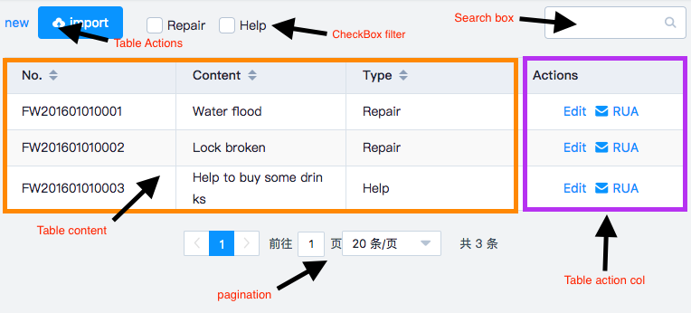

# Introduce

`vue-data-tables` is compose of the following 3 parts:

* Action Bar
* Table
  * Content
  * Column action
* Pagination

## Action Bar
Action Bar is entirely created by users. Most of the time, Action Bar can be independent to `vue-data-tables`, but if needed, we can embed it into `vue-data-tables` by a [slot](https://vuejs.org/v2/guide/components-slots.html#Named-Slots) named `tool`. Refer to the [Action Bar](en-us/actionBar.md) section for more details.

## Table
A embedded [el-table](http://element.eleme.io/#/en-US/component/table). If you are not familiar to [el-table](http://element.eleme.io/#/component/table), please read its document。

### Content
Content to show the data

### Action Column
A embedded [el-table-column](http://element.eleme.io/#/en-US/component/table#table-column-attributes) for quick creating column actions. Refer to the [Action Column](en-us/actionCol.md) section for more details.

## Pagination
A embedded [el-pagination](http://element.eleme.io/#/en-US/component/pagination). If you are not familiar to [el-pagination](http://element.eleme.io/#/en-US/component/pagination), please read its document。For usage in `vue-data-tables`, refer to the [Pagination](en-us/pagination.md) section.
