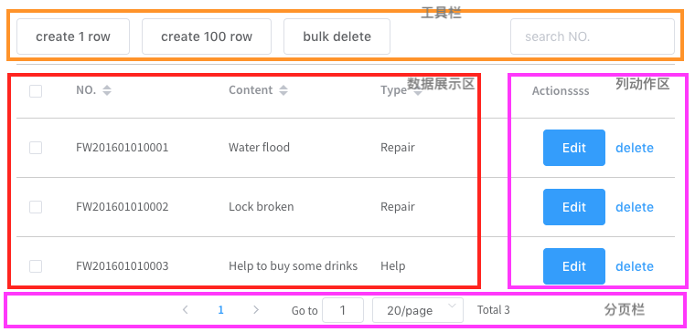

# 介绍
> Introduce to parts of th generated table

本组件由以下3部分组成：

* 工具栏
* 表格
  * 数据展示区
  * 列动作区
* 分页栏

## 工具栏
工具栏完全是由用户自定义的，通常情况下`工具栏`都可以是独立于 `vue-data-tables` 之外的, 如果有必要的话，可以通过名为`tool`的[具名插槽](https://cn.vuejs.org/v2/guide/components-slots.html#%E5%85%B7%E5%90%8D%E6%8F%92%E6%A7%BD)将`工具栏`插入 `vue-data-tables` 中。具体内容请参见[工具栏](zh-cn/actionBar.md)章节。

## 表格
这一部分实际上就是一个内置的 [el-table](http://element.eleme.io/#/zh-CN/component/table)，如果你不了解 [el-table](http://element.eleme.io/#/zh-CN/component/table) 请先仔细阅读其文档。

### 数据展示区
顾名思义，展示数据。

### 列动作区
这部分实际上是一个用于快速创捷列动作的内置的 [el-table-column](http://element.eleme.io/#/zh-CN/component/table#table-column-attributes)。具体内容请参见[动作列](zh-cn/actionCol.md)章节。

## 分页栏
实际上是一个内置的 [el-pagination](http://element.eleme.io/#/component/pagination), 如果不了解请仔细阅读其[文档](http://element.eleme.io/#/zh-CN/component/pagination)。`分页栏`在本库内的使用，请参见[分页](zh-cn/pagination.md)章节。
