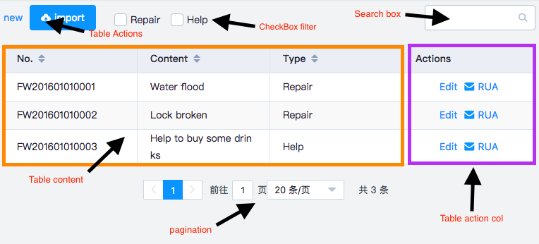

# 介绍
> Introduce to parts of th generated table

本组件由以下3部分组成：

* 工具栏
* 表格
  * 数据展示区
  * 列动作区
* 分页栏

## 工具栏
工具栏完全是由用户自定义的，用户通过名为`tool-bar`[具名插槽](https://cn.vuejs.org/v2/guide/components-slots.html#%E5%85%B7%E5%90%8D%E6%8F%92%E6%A7%BD)将`工具栏`插入`DataTables`或`DataTablesServer`中。

## 表格
这一部分实际上就是一个[el-table](http://element.eleme.io/#/zh-CN/component/table)，如果你不了解[el-table](http://element.eleme.io/#/zh-CN/component/table)请先仔细阅读其文档。
### 数据展示区
顾名思义，展示数据。

### 列动作区
内置的动作列，便于用户快速创建针对列的动作按钮。

## 分页栏
实际上是一个[el-pagination](http://element.eleme.io/#/zh-CN/component/pagination), 如果不了解请仔细阅读其文档, 注意它的[L10N](quickstart?id=l10n-show-english-in-pagination)。
